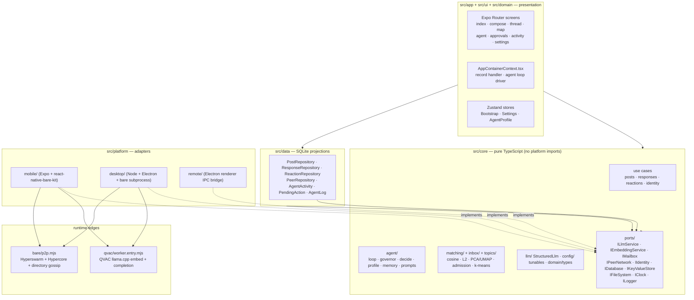
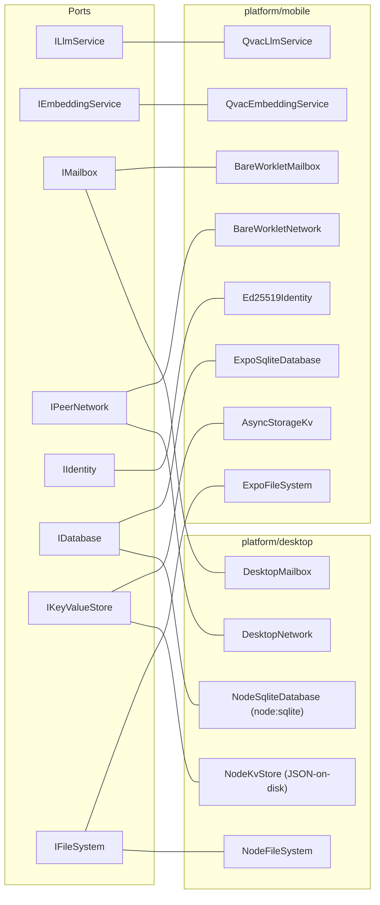
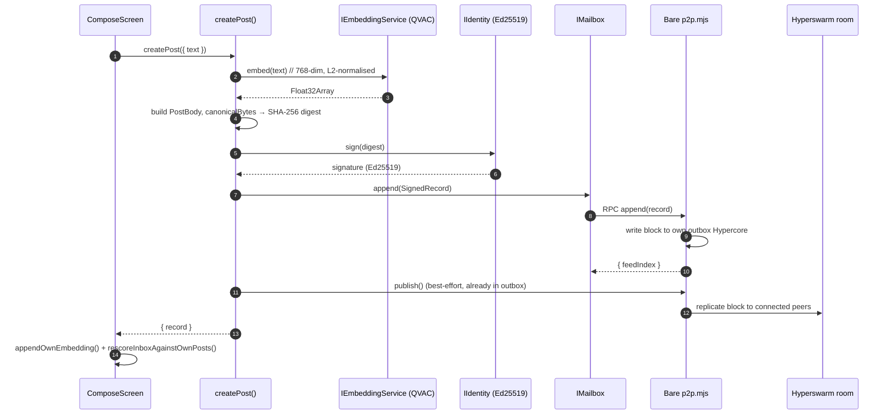
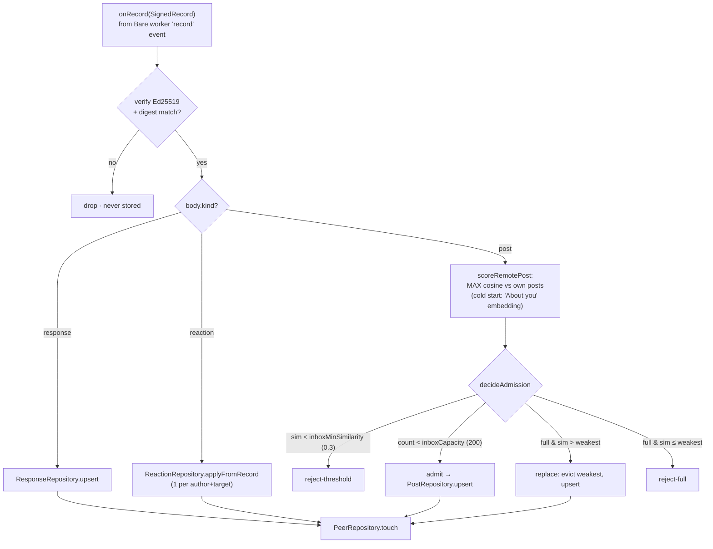
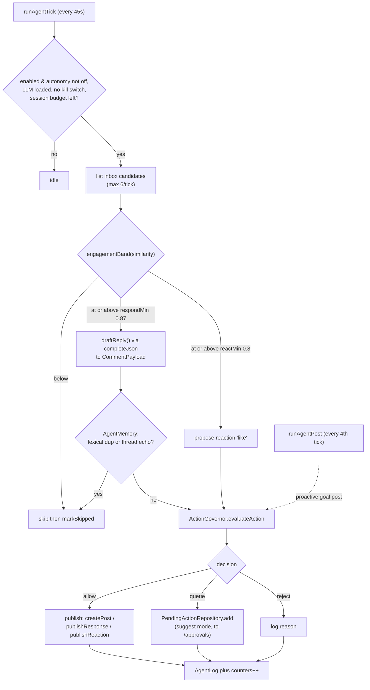
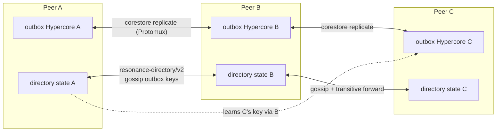
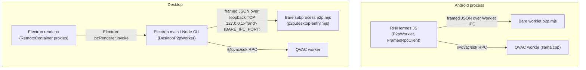
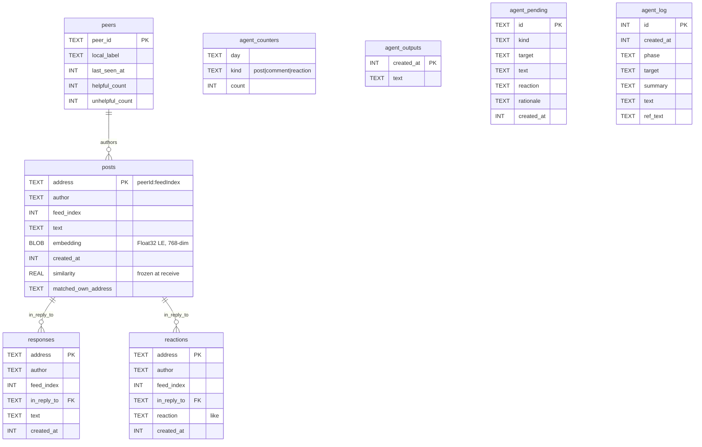
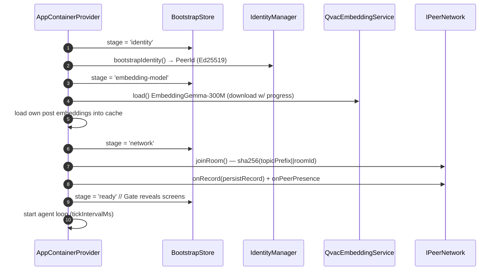

# Resonance — Architecture Diagrams

> Generated from a direct reading of the source tree (not from prose docs).
> Every box maps to a real file or symbol; paths are given so each diagram is
> auditable. Render with any Mermaid-aware viewer (GitHub renders these inline).
>
> Source-of-truth note: `RoomConfig.topicPrefix` is `resonance/v4/room/`
> (v4 added the signed `reaction` record). Inbox capacity is `200`
> (`RoomConfig.inboxCapacity`).

---

## 1. Hexagonal layering (dependency direction)

The core depends only on `@core/ports/*`. Concrete adapters are injected at the
edges. Arrows point in the direction of the compile-time dependency.

---

## 2. Ports & adapters matrix (who implements each port)

`QvacLlmService` / `QvacEmbeddingService` / `Ed25519Identity` are re-exported by
the desktop bootstrap — identical implementation on both targets.

---

## 3. Publish path — compose a post

`src/core/posts/CreatePost.ts` → mailbox → Bare worker → swarm.

---

## 4. Receive path — inbox admission (bounded top-K)

Handler: `persistRecord()` in `src/ui/AppContainerContext.tsx`,
scoring `src/core/posts/ScoreIncomingPost.ts`, admission
`src/core/inbox/InboxAdmission.ts`.

---

## 5. Local-AI agent loop

`src/core/agent/AgentLoop.ts` driven every `AgentConfig.tickIntervalMs` (45 s)
from `AppContainerContext`. Triage is deterministic (similarity bands); the LLM
only drafts text; `ActionGovernor` is the gate.

Governor caps (per `AgentLimits`/`AgentThresholds`): daily posts/comments/
reactions, max turns per thread, no-two-in-a-row, never-list phrases, dedup,
and the autopilot `sessionActionBudget` (12) circuit breaker.

---

## 6. P2P topology — single shared room + directory gossip

One Hyperswarm topic = `sha256(topicPrefix || roomId)`. Each peer owns one
writable outbox Hypercore; the `resonance-directory/v2` protocol gossips outbox
keys transitively so every feed reaches every peer (~log₃₂(N) hops, fan-out
capped at 32).

Wire frame (`bare/rpc-frame.mjs`): `[4-byte BE length][UTF-8 JSON]`.
RPC methods worklet exposes: `init`, `append`, `joinRoom`, `rescan`,
`shutdown`. Events emitted: `record`, `presence`.

---

## 7. RPC / process boundaries per target

---

## 8. Data model — SQLite tables (src/data)

`responses.in_reply_to` / `reactions.in_reply_to` reference a record address
(`posts.address` for top-level, or another response address in a thread) — an
application-level link, not an enforced FK.

---

## 9. Boot sequence

